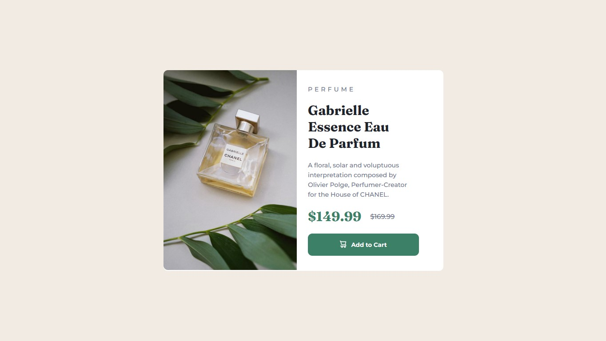

# Frontend Mentor - Product preview card component solution



Esta é uma solução para o Desafio [Product preview card component challenge on Frontend Mentor](https://www.frontendmentor.io/challenges/product-preview-card-component-GO7UmttRfa). Os desafios do Frontend Mentor ajudam você a melhorar suas habilidades de codificação criando projetos realistas. 

### 🎯 O desafio 

Os usuários devem ser capazes de:

- Veja o layout ideal dependendo do tamanho da tela do dispositivo
- Veja os estados de foco e foco para elementos interativos

### 🔗 Links 

- Solução no Frontend Mentor: [Clique aqui.](https://www.frontendmentor.io/solutions/product-preview-card-with-flexbox-PV12aAvgg1)

- Deployment no Github Pages: [Clique aqui.](https://fransuelton.github.io/product-preview-card-component/)

### ✨ Tecnologias Utilziadas

- Semantic HTML5 markup
- CSS
- Flexbox

### 📚 Aprendizado

Com esse desafio, pude mais uma vez colocar em prática meus conhecimentos em HTML, CSS, Flexbox e responsividade. Utilizei a tag `picture` do HTML para criar imagens responsivas que ficam visíveis dependendo do tamanho da tela.

Aqui está um exemplo básico de como utilizei a tag:

```html
<picture>
    <source srcset="desktop-image.jpg" media="(min-width:768px)">

    
</picture>
```

### 🚀 Desenvolvimento contínuo

Estou praticando bastante as tags semânticas do HTML e os conceitos de Flexbox e Grid do CSS. Esse desafio em particular era muito complicado para mim no começo, antes de conhecer a magia do Flex e do Grid. Hoje posso dizer que se tornou fácil para mim. Vou continuar estudando e, principalmente, praticando com os desafios do Frontend Mentor e projetos pessoais. Gostaria de expressar meus agradecimentos aos gêmeos do curso DevQuest, que estão me ajudando nessa jornada. Vamos em frente!

## 🙋 Autor

- Perfil no Linkedin - [Acesse aqui.](https://www.linkedin.com/in/fransuelton/)
- Página no Frontend Mentor - [Acesse aqui.](https://www.frontendmentor.io/profile/Fransuelton)

